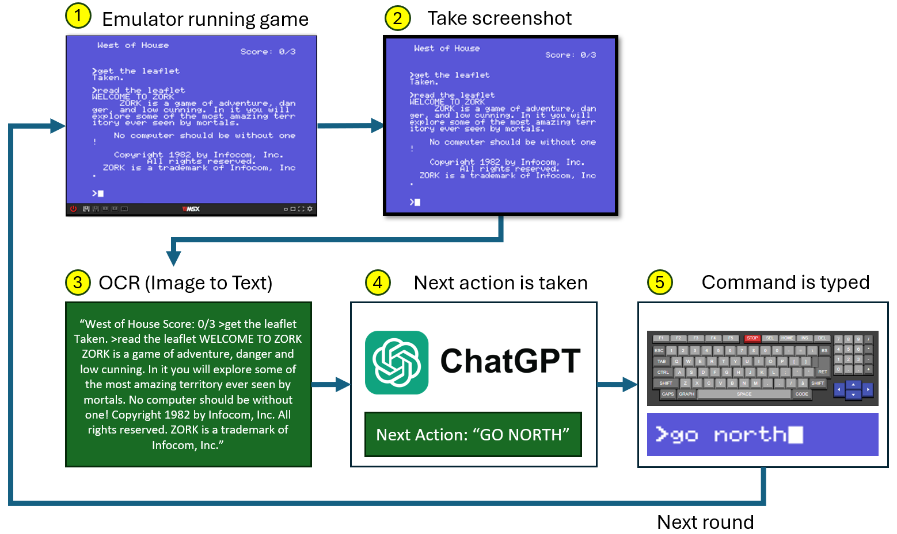
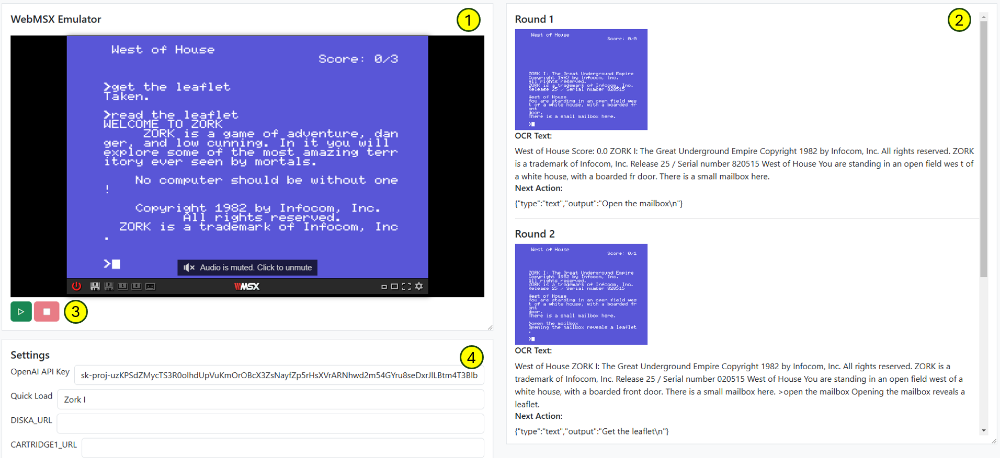

# AI Adventure Solver

**AI Adventure Solver** is an **AI-powered** robot capable to **explore** and **potentially win** vintage **Text Adventure Games** for MSX (8-bits computer)

## What are Text Adventures?

Text Adventure Games are early computer games, popular in the late 1970s and 1980s, that rely entirely on text-based input and output. Players interact with the game by typing commands like "go north" or "pick up key", while the game responds with descriptive text narrating the environment, events, and outcomes of their actions. 

%20(3).png "MSX Games World - Zork I - The Great Underground Adventure")

*MSX Games World - Zork I - The Great Underground Adventure*

These games require imagination and problem-solving skills, as they lack graphics and rely on written storytelling. Despite their simplicity, they offer deep and engaging experiences through intricate puzzles and immersive narratives.

## How does it work?

AI Adventure Solver loads the adventure game inside the MSX emulator **[1]**, takes a screenshot of the current screen **[2]**, submits the image to an OCR process (Optical Character Recognition) to extract the text **[3]**, then using ChatGPT it will decide the best next action **[4]**, which is then automatically typed back in the emulator **[5]**. The process is repeated in rounds, until the game is finished (by winning or losing).

*Flow of the AI Adventure Solver*

## UI Parts

The image below shows the following parts of the UI:

1. **MSX Emulator:** runs the vintage game
2. **Rounds List:** during the game exploration, this list is gradually updated with information of each round
3. **Play** and **Stop** wil start and stop the exploration loop
4. **Settings Panel:** configure and adjust the system settings. See [details on each settings parameters here](#configuration)

## AI Adventure Solver in action

The video below shows the AI Adventure Solver in action while exploring the adventure "ZORK I"

*AI Adventure Solver in action*

## Installation

You can see the **AI Adventure Solver** in action here:

* [https://www.peplau.com.br/AI-Adventure-Solver](https://www.peplau.com.br/AI-Adventure-Solver)

You can also run it in your own server. For that, upload the files from the folder **dist** into your server and browse it... Simple like that!

## Configuration

After the first load, the settings are pre-populated with some crucial values. To setup it for the first time, fill up the following parameters:

1. **OpenAI API Key:** Fill up with your OpenAI API Key. If you don't have one yet, make sure to create your own [following this guide](CreatingAPIKey.md).
2. **Quick Load:** Select one of the available games from this dropdown. Alternatinely, you can load your own disk (.dsk or .zip) by filling the parameter **DISKA_URL** with a public URL to your file, or load your own cartridge (.rom or .zip) by filling the parameter **CARTRIDGE1_URL** with a recpective public URL as well.
3. Click the SAVE button (at the bottom of the Settings window) and refresh the page to see the game start.

Below is a list of all available parameters and their respective descriptions. Please note that some settings requires the page to be refreshed when they are modified.

**IMPORTANT:** Make sure that you don't modify parameters while the loop is active.

| Parameter | Description | Default Value | Page refresh required |
| --- | --- | --- | --- |
| OpenAI API Key | OpenAI API Key. If you don't have one yet, make sure to create your own [following this guide](CreatingAPIKey.md) |  | NO |
| Quick Load | Dropdown with the games available natively |  | YES |
| DISKA_URL | URL pointing to a disk image (.dsk or .zip) |  | YES |
| CARTRIDGE1_URL | URL pointing to a cartridge image (.rom or .zip) |  | YES |
| Machine | MSX Machine to use. Eg: MSX1, MSX2, etc. [See more details here](https://github.com/ppeccin/WebMSX?tab=readme-ov-file#choosing-a-machine) | MSX1 | YES |
| Key Press Delay | Time to keep a key pressed when typing, in milliseconds | 300 | NO |
| Text Type Delay | Time to wait between the moment the key is released and the next key is pressed, in milliseconds | 450 | NO |
| MultiKey Press Delay | Time to hold multiple keys pressed (Eg: CTRL+A), in milliseconds | 1000 | NO |
| Max Tokens | Maximum number of tokens to be returned by the AI | 500 | NO |
| Model | ChatGPT model to be used. Eg: gpt-4o, gpt-4o, o1-preview, etc. [See more details here](https://platform.openai.com/docs/models) | gpt-4o | NO |
| Max Rounds | Maximum number of rounds to play. If this number is exceeded, the loop will automatically stop | 500 | NO |
| Round Delay | Delay between rounds, in milliseconds. This number will be multiplied by the number of commands decided by the AI. Eg: one command = 15000ms, two commands = 30000ms, etc. | 15000 | NO |
| Prompt | Screen analysis prompt to be used with the OpenAI API to decide the next action. | [Default value](dist/defaultPrompt.js) | NO |
| Walkthrough | (Optional) Paste the game walkthrough here to help the AI solve the game |  | NO |

## Using the AI Adventure Solver

To run the software, execute the following steps:

1. Access the system URL (Either [https://www.peplau.com.br/AI-Adventure-Solver](https://www.peplau.com.br/AI-Adventure-Solver) or your website).
2. Make sure the **Settings** are correct, as described in the previous section.
3. Wait for the game to load
4. Click at the Start button
5. Have fun watching the system explore your Adventure

